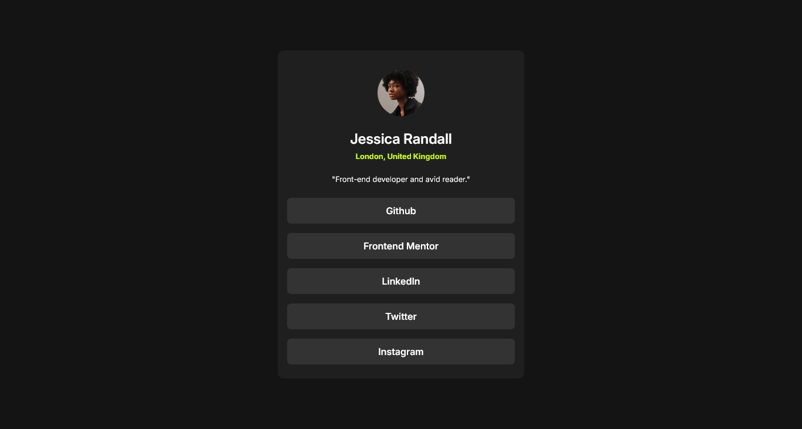

# Frontend Mentor - Social links profile solution

This is a solution to the [Social links profile challenge on Frontend Mentor](https://www.frontendmentor.io/challenges/social-links-profile-UG32l9m6dQ). Frontend Mentor challenges help you improve your coding skills by building realistic projects. 

## Table of contents

- [Overview](#overview)
  - [The challenge](#the-challenge)
  - [Screenshot](#screenshot)
  - [Links](#links)
  - [Built with](#built-with)
  - [Continued development](#continued-development)
  - [Useful resources](#useful-resources)
- [Author](#author)


### The challenge

Users should be able to:

- See hover and focus states for all interactive elements on the page

### Screenshot




### Links

- Solution URL: [solution](https://github.com/shaheerahmedkhan11/social-links-profile)
- Live Site URL: [live site URL](https://shaheerahmedkhan11.github.io/social-links-profile/)


### Built with

- Semantic HTML5 markup
- CSS custom properties
- Flexbox
- Mobile-first workflow
- [Styled Components](https://styled-components.com/) - For styles


Some CSS i am proud of:

```css
  
button:hover,
button:focus {
  background-color: var(--GREEN);
  cursor: pointer ;
  transform: translateY(2px);
  transition: all 0.3s ease-in-out;
}
```


### Useful resources

- [MDN Docs](https://www.example.com)
- [CSS Tricks](https://css-tricks.com/) 


## Author

- Website - [Shaheer](https://shaheerahmedkhan11.github.io/social-links-profile/)
- Frontend Mentor - [@shaheerahmedkhan11](https://www.frontendmentor.io/profile/shaheerahmedkhan11)

